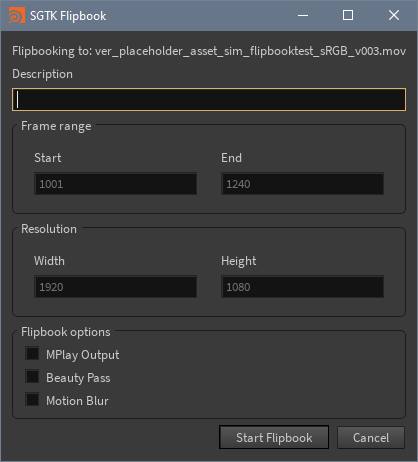

# tk-houdini-flipbook

`tk-houdini-flipbook` is a Shotgun Toolkit app to create flipbooks of your current scene with the use of SGTK templates. It uses **FFMPEG** to create a preview file that is automatically uploaded to Shotgun and linked to a new version. This `tk-houdini-flipbook` is a modified version from https://github.com/nfa-vfxim/tk-houdini-flipbook/.

## Requirements
ffmpeg installed and mapped in Environment Variables

## License
[MIT](https://choosealicense.com/licenses/mit/)
